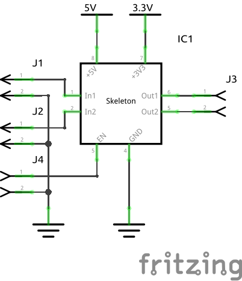

# InkScape Document Properties

|Document Properties|Grid1|Grid2|
|:---:|:---:|:---:|
||||

* Document Properties
  * Display 
    * Front page
      * ***Format A4, in***
      * ***Scale: 0,001000 in per user unit***
      * Viewbox
        * X: 0,000
        * Y: 0,000
        * Width: 8267,716
        * Height: 11692,913
    * Display
      * ***Display units: in***
      * Border
        * ***Show shadow: Unchecked***
  * Grids
    * grid1
      * Grid units: in
      * Origin X: 0,00000
      * Origin Y: 0,00000
      * ***Spacing X: 0,10000***
      * ***Spacing Y: 0,10000***
      * ***Minor grid line color: RGB 0,0,229,15***
      * ***Major grid line color: RGB 0,153,0,100***
      * ***Major grid lineevery: 2***
    * grid2
      * Grid units: in
      * Origin X: 0,00000
      * Origin Y: 0,00000
      * ***Spacing X: 0,02500***
      * ***Spacing Y: 0,02500***
      * ***Minor grid line color: RGB 0,0,229,15***
      * ***Major grid line color: RGB 0,153,0,100***
      * ***Major grid lineevery: 4***

## Intro

I have learned from microMerkin's contribution in the Fritzing forum the importance of having control over the scaling, so therefore I set Scale to 0.00100 in per user unit.  
I have experienced that having 2 sets of grids, which you can easily switch between, promotes work efficiency.

## Schematic View Graphics

|skeleton_DIP_8_300mil_schematic.svg|Skeleton_Sketch.fzz|
|:---:|:---:|
||

* Files
  * [skeleton_DIP_8_300mil_schematic.svg](./Skeleton/skeleton_DIP_8_300mil_schematic.svg)
  * [Skeleton_Sketch_schem.png](./Skeleton/Skeleton_Sketch_schem.png)
  * [Skelenton-8-pins.fzpz](./Skeleton/Skelenton-8-pins.fzpz)
  * [Skeleton_Sketch.fzz](./Skeleton/Skeleton_Sketch.fzz)

### Skeleton XML code sample

Header:

```code
<?xml version="1.0" encoding="UTF-8" standalone="no"?>
<!-- Created with Inkscape (http://www.inkscape.org/) -->

<svg
   width="0.700in"
   height="0.700in"
   viewBox="0 0 700 700"
   version="1.1"
   id="svg1"
   xmlns="http://www.w3.org/2000/svg"
   xmlns:svg="http://www.w3.org/2000/svg">
  <defs
     id="defs1" />
```

Help Group:

```code
<g
     id="help">
    <rect
       stroke-dasharray="none"
       stroke-width="0"
       stroke="none"
       fill-opacity="0.15"
       fill="none"
       y="0"
       x="0"
       height="700"
       width="700"
       id="background" />
  </g>
  
```

Schematic group:

part_symbol & Label:

```code
<g
   id="schematic">
  <rect
     stroke-opacity="1"
     stroke-dasharray="none"
     stroke-linecap="round"
     stroke-width="12"
     stroke="#000000"
     fill="none"
     y="100"
     x="100"
     height="500"
     width="500"
     id="part_symbol" />
  <text
     font-size="48"
     x="350"
     text-anchor="middle"
     gorn="0.1.1"
     y="350"
     id="label"
     font-family="'Droid Sans'"
     stroke="none"
     fill="#000000">Label</text>
```

Pins group sample:

```code
    <g
       id="pins">
      <g
         id="pins_north">
        <line
           y2="95"
           stroke-width="10"
           stroke-linecap="round"
           y1="5"
           stroke-linejoin="round"
           x2="200"
           x1="200"
           stroke="#787878"
           fill="none"
           id="connector7pin" />
        <rect
           paint-order="fill markers stroke"
           stroke-dasharray="none"
           stroke-linecap="round"
           stroke-width="0"
           stroke="none"
           fill="none"
           y="-5"
           x="195"
           height="10"
           width="10"
           id="connector7terminal" />```

Pin labels group sample:

```code
    <g
       id="pin_labels">
      <g
         id="pin_labels_north">
        <text
           font-size="48"
           x="8"
           text-anchor="middle"
           gorn="0.1.5"
           y="243"
           id="label7"
           font-family="'Droid Sans'"
           stroke="none"
           fill="#8c8c8c"
           transform="rotate(-45)">+5V</text>
```

Pin numbers group sample:

```code
    <g
       id="pin_numbers">
      <g
         id="pin_numbers_north">
        <text
           stroke-width="0"
           font-size="34"
           x="185"
           text-anchor="end"
           y="79"
           class="text"
           font-family="'Droid Sans'"
           stroke="none"
           fill="#8c8c8c"
           id="text8">8</text>
```

XML code end

```code
      </g>
    </g>
  </g>
</svg>
```
