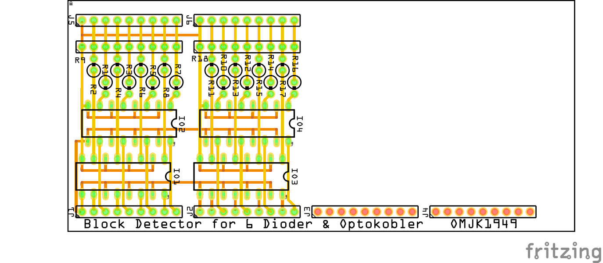
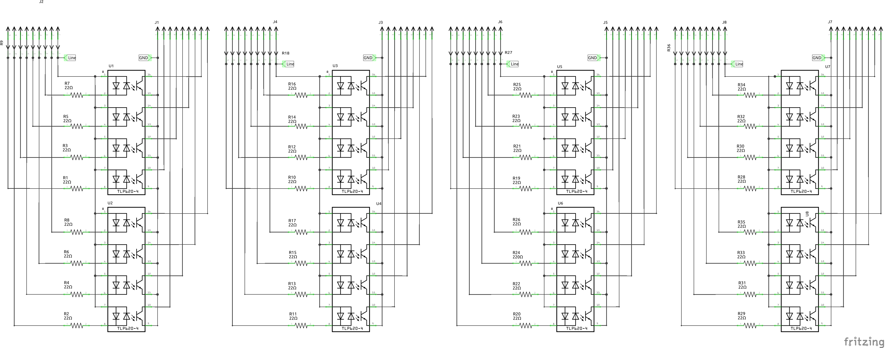

# Block Detector

## Block Detector med BD20

**I2C IO_Interface card** is used to read [block detection Output from BD20](https://ncedcc.zendesk.com/hc/en-us/articles/201254549-BD20-Block-Detector) and send it via [ESPHome I2C BUS](https://esphome.io/components/i2c.html) to [Home Assistant](https://www.home-assistant.io/), that then handle the data.

### Prototype I2C IO_Interface

|Breadbord|Schematic|
|:---:|:---:|
||

* Fritzing files:
  * [I2C_IO_Interface_proto.fzz](./I2C_%20IO_Interface_proto.fzz)

### I2C IO_Interface PCB

|PCB|Schematic|
|:---:|:---:|
||

* Fritzing files:
  * [I2C_IO_Interface.fzz](./I2C_%20IO_Interface.fzz)

## BlockDetector  Width 6 Dioder and Optokobler

**BlockDetectormed_6_Dioder_Optokobler card** send it data to **I2C IO_Interface card** that then send data via [ESPHome I2C BUS](https://esphome.io/components/i2c.html) to [Home Assistant](https://www.home-assistant.io/), that then handle the data.

|PCB|Schematic|
|:---:|:---:|
||

* Fritzing files:
  * [BlockDetectormed_6_Dioder_Optokobler.fzz](./BlockDetectormed_6_Dioder_Optokobler.fzz)
