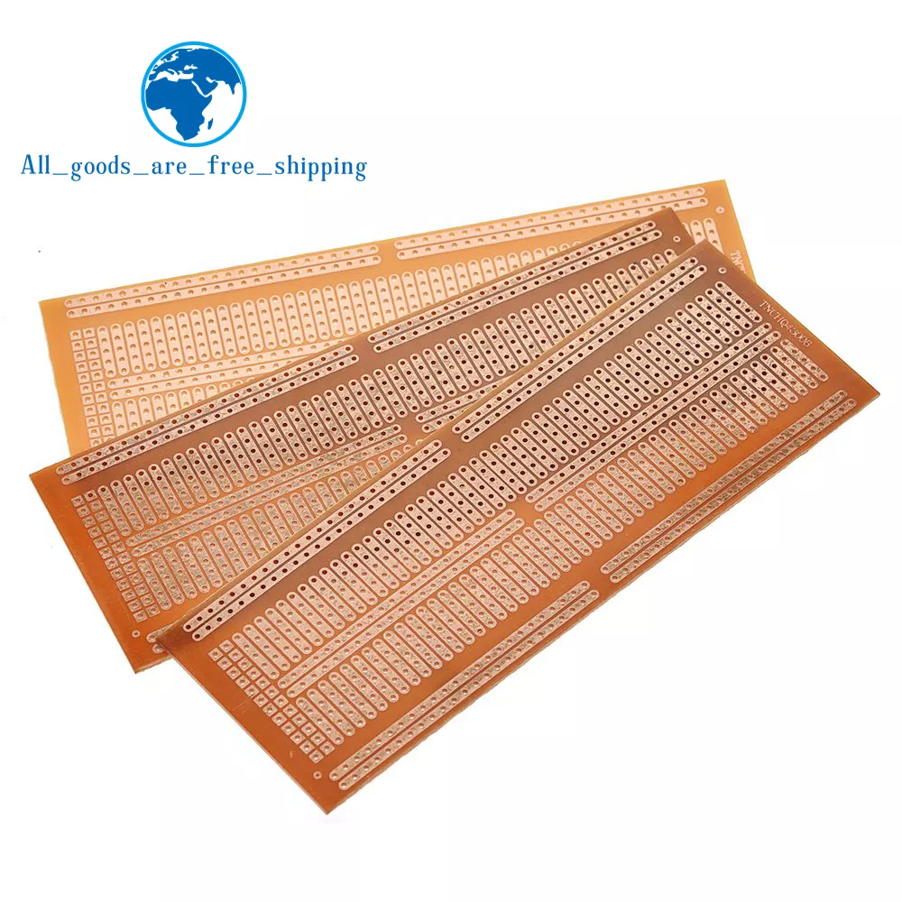

# Block Detector

## Block Detector med BD20

||
|:---:|
||
||
||

* PCB
  * [TZT 5PCS 48X133 48*133MM Single Side Prototype PCB Universal Board Experimental Bakelite Copper Plate Circuirt Board](https://www.aliexpress.com/item/1005002879273095.html?spm=a2g0o.detail.pcDetailTopMoreOtherSeller.4.345cPuayPuayQ6&gps-id=pcDetailTopMoreOtherSeller&scm=1007.40050.354490.0&scm_id=1007.40050.354490.0&scm-url=1007.40050.354490.0&pvid=f1946a63-1660-4f77-a7e4-bb157aa9a823&_t=gps-id:pcDetailTopMoreOtherSeller,scm-url:1007.40050.354490.0,pvid:f1946a63-1660-4f77-a7e4-bb157aa9a823,tpp_buckets:668%232846%238113%231998&pdp_npi=4%40dis%21DKK%2134.58%2130.43%21%21%215.00%214.40%21%402103250717078170824321189ef95b%2112000036451082897%21rec%21DK%21776792731%21&utparam-url=scene%3ApcDetailTopMoreOtherSeller%7Cquery_from%3A)