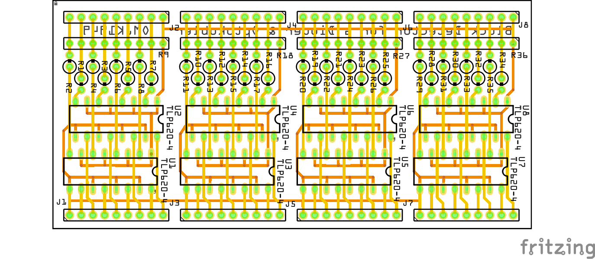

# Block Detector

## Block Detector med BD20

### Prototype I2C IO_Interface

|Breadbord|Schematic|
|:---:|:---:|
||

* Fritzing files:
  * [I2C_IO_Interface_proto.fzz](./I2C_%20IO_Interface_proto.fzz)

### I2C IO_Interface PCB

|PCB|Schematic|
|:---:|:---:|
||

* Fritzing files:
  * [I2C_IO_Interface.fzz](./I2C_%20IO_Interface.fzz)

## BlockDetectormed_6_Dioder_Optokobler

|PCB|Schematic|
|:---:|:---:|
||

* Fritzing files:
  * [BlockDetectormed_6_Dioder_Optokobler.fzz](./BlockDetectormed_6_Dioder_Optokobler.fzz)
