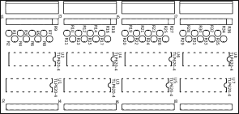
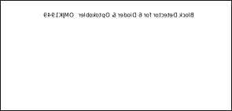

# Block Detector

### I2C IO_Interface PCB

|Schematic / PCB|
|:---:|
||
||

||svg|
|:---:|:---:|
|copper_top||
|copper_bottom||
|silk_top||
|silk_bottom||

* Fritzing files:
  * [I2C_IO_Interface.fzz](./I2C_%20IO_Interface.fzz)
  * [I2C_IO_Interface_bom.html](./I2C_%20IO_Interface_bom.html)

### [BlockDetector Width 6 Dioder and Optokobler](./Block_Detecsion/README.md#blockdetector-width-6-dioder-and-optokobler)

|Schematic / PCB|
|:---:|
||
||

||svg|
|:---:|:---:|
|copper_top||
|copper_bottom||
|silk_top||
|silk_bottom||

* Fritzing files:
  * [BlockDetectormed_6_Dioder_Optokobler.fzz](./BlockDetectormed_6_Dioder_Optokobler.fzz)

## Prototype I2C IO_Interface

|Schematic / PCB|
|:---:|
||
||

* Fritzing files:
  * [I2C_IO_Interface_proto.fzz](./I2C_%20IO_Interface_proto.fzz)

