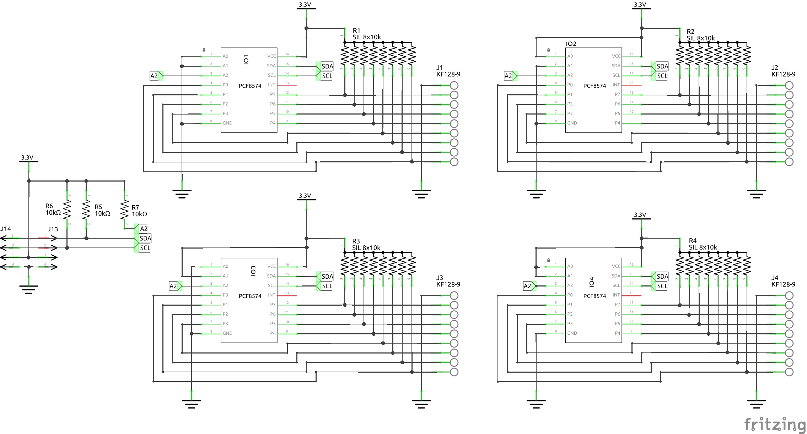
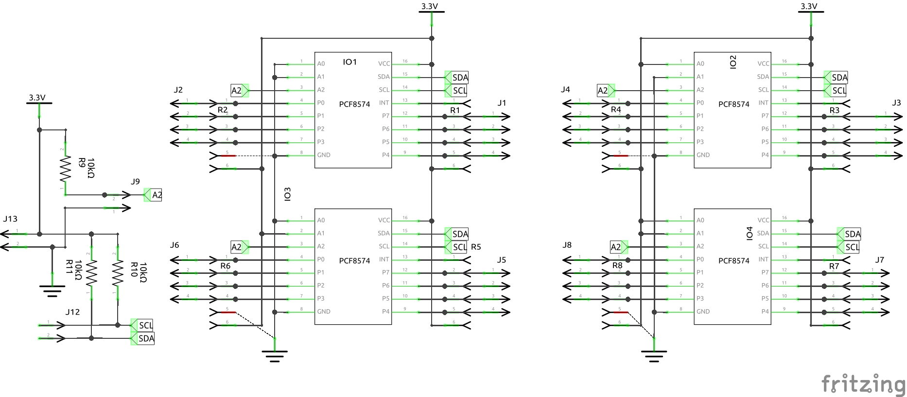
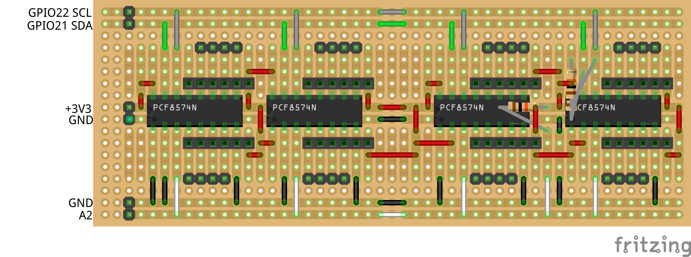

# I2C IO_Interface

## I2C IO_Interface

|Schematic / PCB|
|:---:|
||
||

* Fritzing files:
  * [I2C_IO_Interface_proto.fzz](./I2C_%20IO_Interface_proto.fzz)

## Prototype I2C IO_Interface

|Schematic / PCB|
|:---:|
||
||

* Fritzing files:
  * [I2C_IO_Interface_proto.fzz](./I2C_IO_Interface.fzz)
