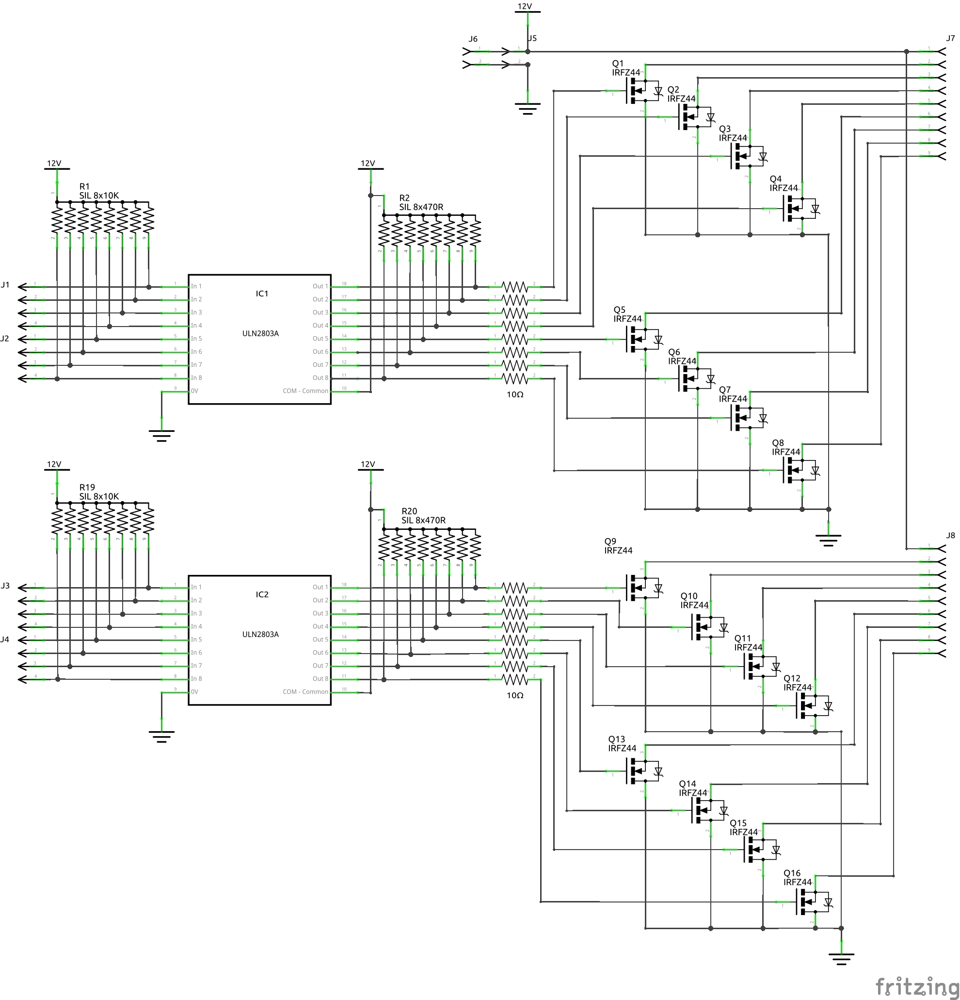
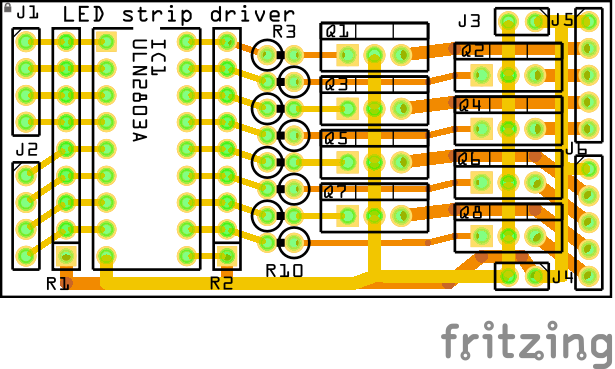
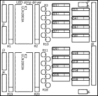

# LED Strip Driver

|Schematic / PCB|
|:---:|
||
||

||svg|
|:---:|:---:|
|copper_top||
|copper_bottom||
|silk_top||
|silk_bottom||

* Fritzing files:
  * [I2C_IO_Interface.fzz](./LedStripDriver.fzz)
