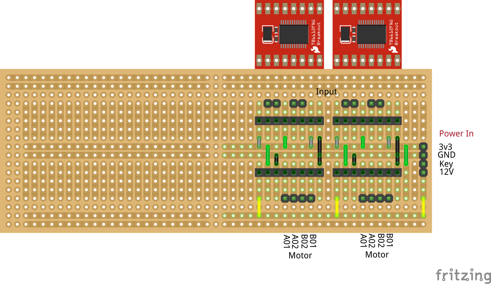

# Sporskifte Driver med TB6612FNG for Tortoise Point Motors

* Datasheet:
  * [TB6612FNG](https://www.sparkfun.com/datasheets/Robotics/TB6612FNG.pdf)
  * [Tortoise Point Motors 800-6000](https://www.coastaldcc.co.uk/products/circuitron/tortoise-point-motors)

## Grundmodul for 10 sporskifte driver

|Breadboard|
|:---:|
||

* Fritzing files:
  * [TB6612FNG_10.fzz](./TB6612FNG_10.fzz)
* Datasheet:
  * [TB6612FNG](https://www.sparkfun.com/datasheets/Robotics/TB6612FNG.pdf)
  * [HV-613 DC-DC Converter](https://www.sigmaelectronica.net/producto/hw-613/)
  * [TZT 5PCS 48X133 48*133MM Single Side Prototype PCB](https://vi.aliexpress.com/item/1005002879273095.html?spm=a2g0o.order_list.order_list_main.71.757379d2XB2eEV&gatewayAdapt=glo2vnm)

## Udvidelsesmodul for 4 sporskifte driver

|Breadboard|
|:---:|
||

* Fritzing files:
  * [TB6612FNG_01.fzz](./TB6612FNG_04.fzz)
