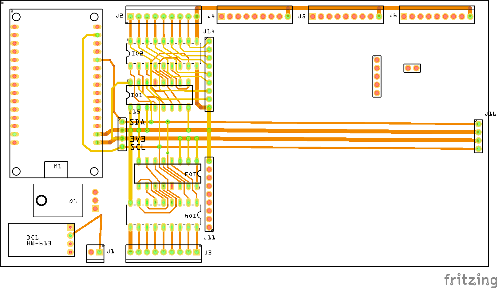

# PCB Board for Home Assistant

### [PWM_Light_Controller](./PWM_Light_Controller/PWM_Light_Controler_v1_3/PWM_Light_Controler_v1_3.fzz)

The PWM Light Controller is a light controller based on an ESP32 and Power Mosfet, it also has an I2C interface where I have connected a BMP230 climate sensor.

|Schematic|PCB|
|:---:|:---:|
||||

* [Fritzing file for download:](./PWM_Light_Controller/PWM_Light_Controler_v1_3/PWM_Light_Controler_v1_3.fzz)

### IHC Replacement

|Schematic / PCB|
|:---:|
||
|

* Fritzing files:
  * [IHC_Replacment_001.fzz](./IHC_Replacment/IHC_Replacment_001.fzzIHC_Replacment/IHC_Replacment_001.fzz)
* FreeCAD files :
  * [IHC_Replacment:](https://github.com/sekt1953/FreeCAD/blob/main/README.md#ihc-replacement)

### [LedDriver with Darlinton array](./Darlinton_Relay_and_Led_Driver/) work in progress

The printed circuit board is a driver card for leds and relays with an common Anode (+power).

|Schematic|
|:---:|
||

|copper_top|copper_bottom|silk_top|
|:---:|:---:|:---:|
||||

* [Fritzing file for download:](./Darlinton_Relay_and_Led_Driver/PCF8574_ULN2803.fzz)

