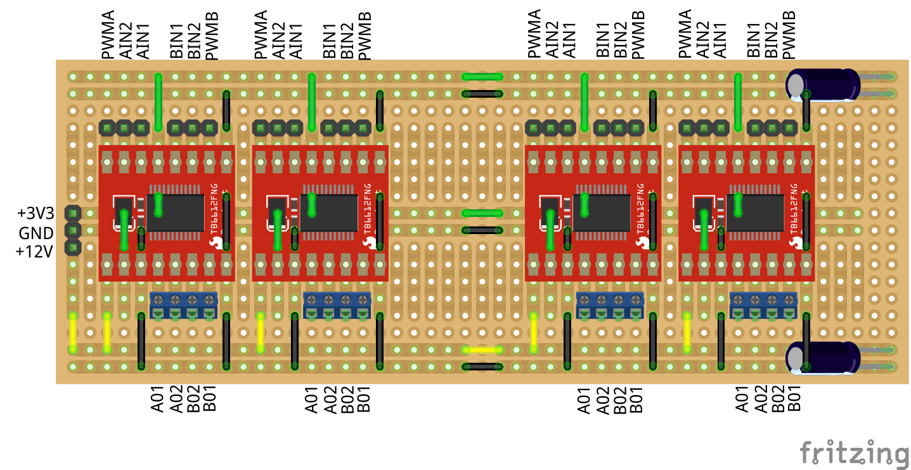

# My PCB with Fritzing

I'm quite happy with using Fritzing to make my printed circuit boards, it can do most of what I need.

## PCB Board for modelrailway [OMJK1949](https://www.omjk.dk/)

* [CPU](./Modeltog/Cpu/README.md)
  * [ESP32 ESP32S 30Pin Expansion board](./Modeltog/Cpu/README.md#esp32-esp32s-30pin-expansion-board)
* [Block detection:](./Modeltog/Block_Detecsion/README.md)
  * [I2C IO_Interface PCB](./Modeltog/Block_Detecsion/README.md#i2c-io_interface-pcb)
  * [BlockDetector Width 6 Dioder and Optokobler](./Modeltog/Block_Detecsion/README.md#blockdetector-width-6-dioder-and-optokobler)
  * [Prototype I2C IO_Interface](./Modeltog/Block_Detecsion/README.md#prototype-i2c-io_interface)
* Sporskifte Driver
  * 
    * [Fritzing file](./Modeltog/Sporskifte/TB6612FNG_00.fzz)
* LED Strip Driver
  * [LedStripDriver.fzz](./Modeltog/LedStripDriver/README.md)  

## PCB Board for Home Assistant

* [PWM_Light_Controller](./PCB_Board_for_Home_Assistant/README.md#pwm_light_controller)
  * 
* [IHC Replacement](./PCB_Board_for_Home_Assistant/README.md#ihc-replacement)
  * [LedDriver with Darlinton array work in progress](./PCB_Board_for_Home_Assistant/README.md#leddriver-with-darlinton-array-work-in-progress)
