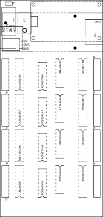

# My PCB maked with Fritzing

I'm quite happy with using Fritzing to make my printed circuit boards, it can do most of what I need.

## List

* PCB for Home Assistant
  * [PWM_Light_Controller](./PWM_Light_Controller/PWM_Light_Controler_v1_3/PWM_Light_Controler_v1_3.fzz)
* PCB for Modelrailway
  * [occupied_sensor](./occupied_sensor/)
  * [Darlinton_Relay_and_Led_Driver](./Darlinton_Relay_and_Led_Driver/)

## PCB Board for Home Assistant

### [PWM_Light_Controller](./PWM_Light_Controller/PWM_Light_Controler_v1_3/PWM_Light_Controler_v1_3.fzz)

The PWM Light Controller is a light controller based on an ESP32 and Power Mosfet, it also has an I2C interface where I have connected a BMP230 climate sensor.

|Schematic|PCB|
|:---:|:---:|
||||

## PCB Board for modelrailway

### [occupied_sensor](./occupied_sensor/) work in progress

Is a card to detect if there are trains on a track section, be it wagons or locomotives, the printed card has 64 inputs.

|Schematic|PCB|
|:---:|:---:|
||||

|copper_top|copper_bottom|silk_top|
|:---:|:---:|:---:|
||||

## LedDriver with optocoupler

### V6.1

The Led Driver printed circuit board is made with optocouplers in order to realize that many LEDs are already mounted with a common cathode, and therefore cannot be controlled with a darlington array, which needs the LEDs to be mounted with a common anode.

|Schematic|
|:---:|
||

||PCB|
|:---|:---|
|copper_top||
|copper_bottom||
|silk_top||

### V6.4 work in progress

|Schematic|
|:---:|
||

||PCB|
|:---|:---|
|copper_top||
|copper_bottom||
|silk_top||

## [LedDriver with Darlinton array](./Darlinton_Relay_and_Led_Driver/) work in progress

The printed circuit board is a driver card for leds and relays with an common Anode (+power).

|Schematic|
|:---:|
||

|copper_top|copper_bottom|silk_top|
|:---:|:---:|:---:|
||||
