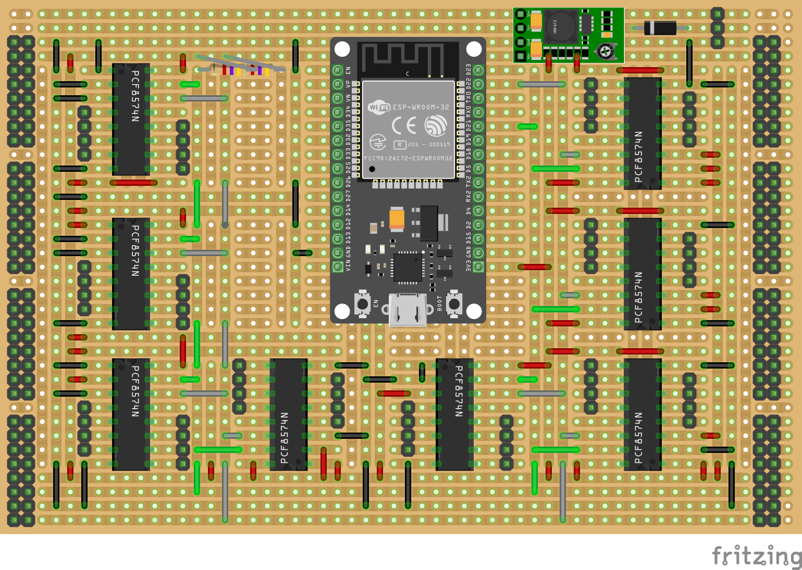
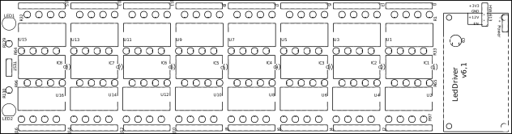
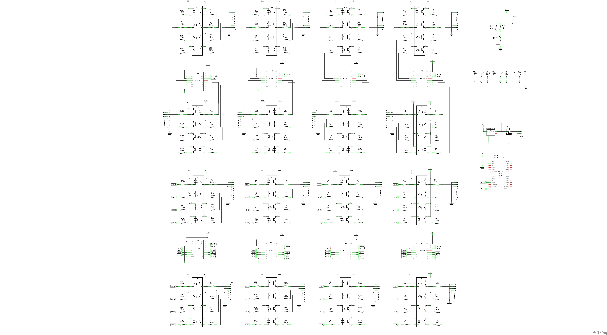

# My PCB maked with Fritzing

I'm quite happy with using Fritzing to make my printed circuit boards, it can do most of what I need.

## List

* PCB from RadeMacher
  * [WR-Typ 922 & 941](README.md#pcb-from-rademacher)
* [PCB for Home Assistant](./README.md#pcb-board-for-home-assistant)
  * [PWM_Light_Controller](./README.md#pwm_light_controller)
  * [IHC_Replacment](./README.md#ihc-replacement)
* [PCB for Modelrailway](./README.md#pcb-board-for-modelrailway)
  * [Occupied Sensor V1](./README.md#occupied_sensor-work-in-progress)
  * [Occupied Hp Proto](./README.md#occupied-hp-proto)
  * [Darlinton_Relay_and_Led_Driver](./README.md#leddriver-with-darlinton-array-work-in-progress)

## PCB from RadeMacher

|RadeMacher Typ922|RadeMacher Typ922 with ESP32 30Pin|
|:---:|:---:|
|||
|||

* Køb:
  * [Conrad Elektronik WR-Typ 922 Printplade](https://www.conradelektronik.dk/da/p/rademacher-wr-typ-922-printplade-til-eksperimenter-haardt-papir-l-x-b-160-mm-x-100-mm-35-m-rastermaal-2-54-mm-indhold-521214.html)
* Fritzing files:
  * WR-Nr.922
    * [RadeMacher_Typ922.fzz](./RadeMacher_WR-Typ-922/RadeMacher_Typ922.fzz)
    * [RadeMacher_Typ922_ESP32.fzz](./RadeMacher_WR-Typ-922/RadeMacher_Typ922_ESP32.fzz)
  * WR-Nr.941
    * [WR Typ 941](https://www.conradelektronik.dk/da/p/rademacher-wr-typ-941-europrintplade-epoxyd-l-x-b-160-mm-x-100-mm-35-m-rastermaal-2-54-mm-indhold-1-stk-529568.html)

## PCB Board for Home Assistant

### [PWM_Light_Controller](./PWM_Light_Controller/PWM_Light_Controler_v1_3/PWM_Light_Controler_v1_3.fzz)

The PWM Light Controller is a light controller based on an ESP32 and Power Mosfet, it also has an I2C interface where I have connected a BMP230 climate sensor.

|Schematic|PCB|
|:---:|:---:|
||||

* [Fritzing file for download:](./PWM_Light_Controller/PWM_Light_Controler_v1_3/PWM_Light_Controler_v1_3.fzz)

### IHC Replacement

|Schematic|PCB|
|:---:|:---:|
||

* Fritzing files:
  * [IHC_Replacment_001.fzz](./IHC_Replacment/IHC_Replacment_001.fzz)
* FreeCAD files :
  * [IHC_Replacment:](https://github.com/sekt1953/FreeCAD/blob/main/README.md#ihc-replacement)

## PCB Board for modelrailway

### [occupied_sensor](./occupied_sensor/) work in progress

Is a card to detect if there are trains on a track section, be it wagons or locomotives, the printed card has 64 inputs.

|Schematic|
|:---:|
||

|copper_top|copper_bottom|silk_top|
|:---:|:---:|:---:|
||||

* [Fritzing file for download:](./occupied_sensor/v1/occupied_sensor.fzz)

### Occupied Hp Proto

Occupied sensor to bee used with NCE 5240205 Block Detector BD20

|Proto type PCB Occupied_Hp|Block Detector BD20|
|:---|:---|
||
|||

* Fritzing files:
  * [Occupied_Hp_Proto.fzz](./occupied_sensor/Occupied-Hp/Occupied_Hp_Proto.fzz)
* FreeCAD files:
  * [Mount WR-Typ nr.922](https://github.com/sekt1953/FreeCAD/tree/main#mount-for-wr-typ-922-pcb)
* ESPHome files:
  * [Occupied-Hp.yaml "Holmstrup"](https://github.com/sekt1953/OMJK?tab=readme-ov-file#esphome)
* PCB:
  * [RadeMacher PCB](./README.md#pcb-from-rademacher)
* NCE 5240205 Block Detector BD20:
  * [Tony's Train Change](https://tonystrains.com/product/nce-5240205-block-detector-bd20)
  * [NCE-BD20-Manual](https://www.dccconcepts.com/manual/nce-owners-manual-bd20-block-detector/nce-bd20-manual-2/)

## LedDriver with optocoupler

### V6.1

The Led Driver printed circuit board is made with optocouplers in order to realize that many LEDs are already mounted with a common cathode, and therefore cannot be controlled with a darlington array, which needs the LEDs to be mounted with a common anode.

|Schematic|
|:---:|
||

||PCB|
|:---|:---|
|copper_top||
|copper_bottom||
|silk_top||

* [Fritzing file for download:](./LedDriver/v6.1/PCB-LedDriver-V6.1.fzz)

### Error i version 6.1 fix in 6.4

|Error v6.1|Fix v6.4|
|:---|:---|
||
|See the blue marking|See marking|

### V6.4 work in progress

v6.4 fixes the plug bug of v6.1 and implements reverse current protection.

|Schematic|
|:---:|
||

||PCB|
|:---|:---|
|copper_top||
|copper_bottom||
|silk_top||

* [Fritzing file for download:](./LedDriver/v6.4/PCB-LedDriver-V6.4.fzz)

## [LedDriver with Darlinton array](./Darlinton_Relay_and_Led_Driver/) work in progress

The printed circuit board is a driver card for leds and relays with an common Anode (+power).

|Schematic|
|:---:|
||

|copper_top|copper_bottom|silk_top|
|:---:|:---:|:---:|
||||

* [Fritzing file for download:](./Darlinton_Relay_and_Led_Driver/PCF8574_ULN2803.fzz)