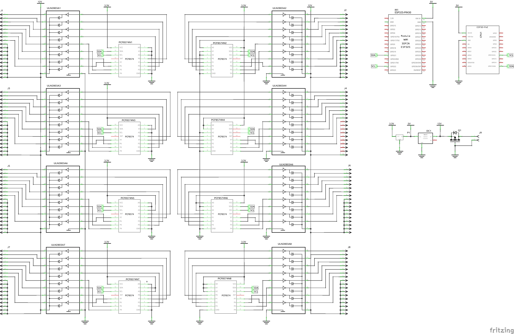

# My PCB maked with Fritzing

I'm quite happy with using Fritzing to make my printed circuit boards, it can do most of what I need.

## List

* [PCB for Home Assistant](./README.md#pcb-board-for-home-assistant)
  * [PWM_Light_Controller](./README.md#pwm_light_controller)
  * [IHC_Replacment](./README.md#ihc-replacement)
* [PCB for Modelrailway](./README.md#pcb-board-for-modelrailway)
  * [Block Detector](./Block_Detecsion/README.md)
  * Old Stuff not in used
    * [Occupied Sensor V1](./README.md#occupied_sensor-work-in-progress)
    * [Occupied Hp Proto](./README.md#occupied-hp-proto)
    * [Darlinton_Relay_and_Led_Driver](./README.md#leddriver-with-darlinton-array-work-in-progress)

## PCB Board for Home Assistant

### [PWM_Light_Controller](./PWM_Light_Controller/PWM_Light_Controler_v1_3/PWM_Light_Controler_v1_3.fzz)

The PWM Light Controller is a light controller based on an ESP32 and Power Mosfet, it also has an I2C interface where I have connected a BMP230 climate sensor.

|Schematic|PCB|
|:---:|:---:|
||||

* [Fritzing file for download:](./PWM_Light_Controller/PWM_Light_Controler_v1_3/PWM_Light_Controler_v1_3.fzz)

### IHC Replacement

|Schematic|PCB|
|:---:|:---:|
||

* Fritzing files:
  * [IHC_Replacment_001.fzz](./IHC_Replacment/IHC_Replacment_001.fzz)
* FreeCAD files :
  * [IHC_Replacment:](https://github.com/sekt1953/FreeCAD/blob/main/README.md#ihc-replacement)

## PCB Board for modelrailway

### [Block Detector Click here](./Block_Detecsion/README.md)

[
|Schematic / PCB|
|:---:|
||
||
](./Block_Detecsion/README.md#i2c-io_interface-pcb)

## [LedDriver with Darlinton array](./Darlinton_Relay_and_Led_Driver/) work in progress

The printed circuit board is a driver card for leds and relays with an common Anode (+power).

|Schematic|
|:---:|
||

|copper_top|copper_bottom|silk_top|
|:---:|:---:|:---:|
||||

* [Fritzing file for download:](./Darlinton_Relay_and_Led_Driver/PCF8574_ULN2803.fzz)