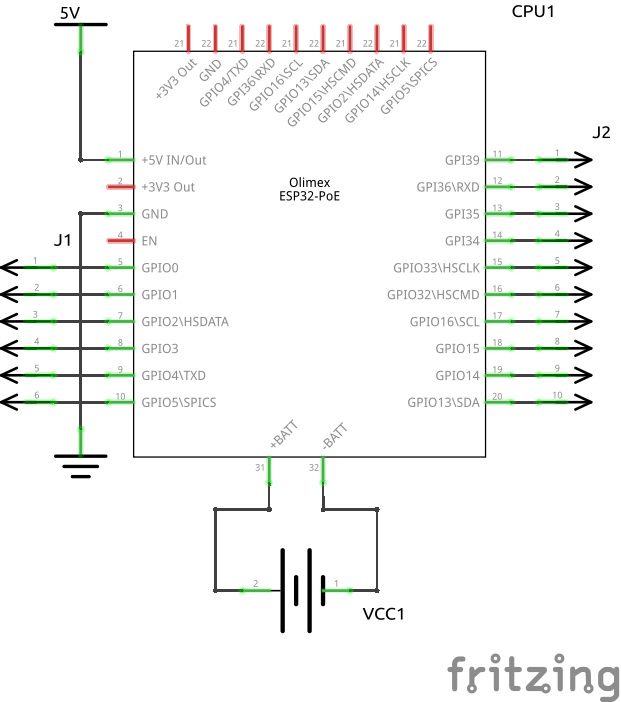

# Howto make Schematic View Graphics

## Intro

I think you should start your PCB layout by creating a circuit diagram, therefore I will start by creating a Schematic View Graphic, my new component, here I have chosen to start with [Olimex's ESP32-PoE](https://www.olimex.com/Products/IoT/ESP32/ESP32-POE/open-source-hardware).

[Olimex-ESP32-PoE has 4 sets of connectors](https://www.olimex.com/Products/IoT/ESP32/ESP32-POE/resources/ESP32-POE-GPIO.png):  

* EXT1 & EXT2 each with 10 pins to be connected to my PCB.
* UEXT which is a connector with 10 pins for connecting another device.
* BATT which has 2 pins for connecting a battery

A total of 32 pins to be displayed in my Schematic View Graphics

## Create Schematic View for Olimex-ESP32-PoE from skeleton.svg

|Skeleton_Sketch_schem.png|Olimex-ESP32-PoE_32pins_Sketch_schem.png|Olimex-ESP32-PoE_32pins_Sketch_schem.png|
|:---:|:---:|:---:|
|)|||

* Files
  * [skeleton_DIP_8_300mil_schematic.svg](./Skeleton/skeleton_DIP_8_300mil_schematic.svg)
  * [Olimex-ESP32-PoE_32pins_schematic.svg](./../Olimex-ESP32-POE/Olimex-ESP32-PoE_32pins/Olimex-ESP32-PoE_32pins_schematic.svg)
  * [Olimex-ESP32-PoE 32pins.fzpz](./../Olimex-ESP32-POE/Olimex-ESP32-PoE_32pins/Olimex-ESP32-PoE%2032pins.fzpz)
  * [Olimex-ESP32-PoE_32pins_Sketch_Sketch.fzz](./../Olimex-ESP32-POE/Olimex-ESP32-PoE_32pins/Olimex-ESP32-PoE_32pins_Sketch_Sketch.fzz)

### Pins

By using this name topology, I achieve that Fritzing New Part Editor automatically binds the svg file's leg names together Fritzing leg description

* Somewhere I have read that you should start by counting leg no. from 0 then
  * connector0terminal is connection point for pin 1
  * connector0pin is pin no.1

My pen number schema:

|type|pin|ext1|ext2|uext|batt|
|:---:|---:|:---|:---|:---|:---|
|rect|1|connector0terminal|connector10terminal|connector20terminal|connector30terminal|
|line|1|connector0pin|connector10pin|connector20pin|connector30pin|
|rect|2|connector1terminal|connector11terminal|connector21terminal|connector31terminal|
|line|2|connector1pin|connector11pin|connector21pin|connector31pin|
|rect|3|connector2terminal|connector12terminal|connector22terminal|connector32terminal|
|line|3|connector2pin|connector12pin|connector22pin|connector32pin|
|rect|4|connector3terminal|connector13terminal|connector23terminal||
|line|4|connector3pin|connector13pin|connector23pin||
|rect|5|connector4terminal|connector14terminal|connector24terminal||
|line|5|connector4pin|connector14pin|connector24pin||
|rect|6|connector5terminal|connector15terminal|connector25terminal||
|line|6|connector5pin|connector15pin|connector25pin||
|rect|7|connector6terminal|connector16terminal|connector26terminal||
|line|7|connector6pin|connector16pin|connector26pin||
|rect|8|connector7terminal|connector17terminal|connector27terminal||
|line|8|connector7pin|connector17pin|connector27pin||
|rect|9|connector8terminal|connector18terminal|connector28terminal||
|line|9|connector8pin|connector18pin|connector28pin||
|rect|10|connector9terminal|connector19terminal|connector29terminal||
|line|10|connector9pin|connector19pin|connector29pin||

My pen label schema:

* [ESP32-POE latest schematic in PDF format](https://github.com/OLIMEX/ESP32-POE/blob/master/HARDWARE/ESP32-PoE-hardware-revision-K/ESP32-PoE_Rev_K.pdf)
* [ESP32-POE GPIO map](https://www.olimex.com/Products/IoT/ESP32/ESP32-POE/resources/ESP32-POE-GPIO.png)

|pen|ext1|ext2|uext|batt|
|---:|:---|:---|:---|:---|
|1|+5V IN/Out|GPI39|+3V3 Out|+BATT|
|2|+3V3 Out|GPI36\RXD|GND|-BATT|
|3|GND|GPI35|GPIO4\TXD||
|4|EN|GPI34|GPI36\RXD||
|5|GPIO0|GPIO33\HSCLK|GPIO16\SCL||
|6|GPIO1|GPIO32\HSCMD|GPIO13\SDA||
|7|GPIO2\HSDATA|GPIO16\SCL|GPIO15\HSCMD||
|8|GPIO3|GPIO15|GPIO2\HSDATA||
|9|GPIO4\TXD|GPIO14|GPIO14\HSCLK||
|10|GPIO5\SPICS|GPIO13\SDA|GPIO5\SPICS||

### How do I make it

* Create new file:
  * Copy the skeleton svg to working directory
  * Rename the skeleton to "Olimex-ESP-PoE_32_schematic.svg" or whatever name you want to use for your component
* Set the size of your component:
  * Set background size
    * Select "Object -> Layers and Objects"
    * Expand the help group
      * Select "background" rectangle object
      * Select "Edit -> XML Editor"
      * Check and edit settings to:
        * |Name|Value|
          |:---|:---|
          |id|background|
          |width|1500|
          |height|1700|
          |x|0|
          |y|0|
          |fill|none|
          |fill-opacity|0.15|
          |stroke|none|
          |stroke-width|0|
          |stroke-dasharray|none|
      * Resize to content:
        * Select: "File -> Document Properties"
        * Click: "Display -> Front page -> Resize to content"
      * Remove Shadow:
        * UnCheck "Display -> Display -> show shadow"
  * Set part_symbol size:
    * Select "Object -> Layers and Objects"
    * Expand the schematic group
      * Select part_symbol rectangle object
    * Select "Edit -> XML Editor"
      * Check and edit settings to:
       * |Name|Value|
         |:---|:---|
         |id|part_symbol|
         |width|1300|
         |height|1500|
         |x|100|
         |y|100|
         |fill|none|
         |stroke|#000000|
         |stroke-width|12|
         |stroke-linecap|round|
         |stroke-dasharray|none|
         |stroke-opacity|1|
      * !!! Note: Do not used "Object -> File And Stroke" it will create a style-object, if there is any style-object then delete it.

