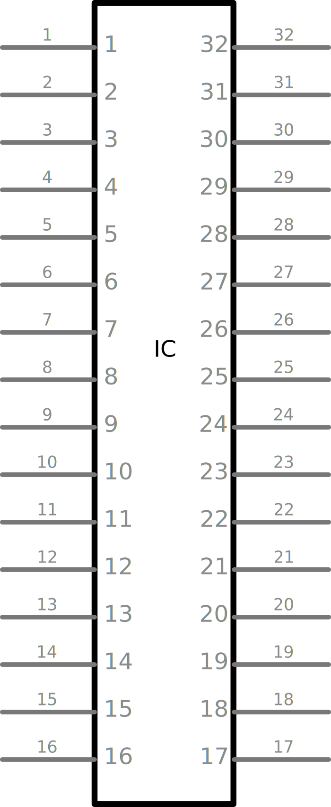

# Howto make Schematic View Graphics

## Intro

I think you should start your PCB layout by creating a circuit diagram, therefore I will start by creating a Schematic View Graphic, my new component, here I have chosen to start with Olimex's ESP32-PoE.

Olimex-ESP32-PoE has 4 sets of connectors:  

* EXT1 & EXT2 each with 10 pins to be connected to my PCB.
* UEXT which is a connector with 10 pins for connecting another device.
* BATT which has 2 pins for connecting a battery

A total of 32 pins to be displayed in my Schematic View Graphics

|Fritzing SVG file|InkScape Document Properties|
|:---:|:---:|
|||

## HowTo

