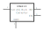
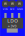
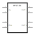
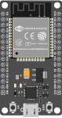
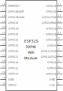
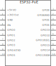
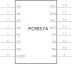
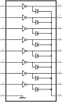

# Components for fritzing that I designed or modified to fit my ideas

I use inkscape to make the svg files, if you want to start making or editing components yourself, just download the svg files in my library and start customizing them, it took me a while to find a good way to make and texts give still torments me.  
If you want to draw your own components I can recommend these videos

* SidneyCritic ComedyHound Videos
  * [Fritzing](https://www.youtube.com/playlist?list=PLMkg9_AB9FZ9PggkzTS1MoHHN40Q2LW1Y "SidneyCritic ComedyHound")
  * [Fritzing Parts Fast](https://www.youtube.com/playlist?list=PLMkg9_AB9FZ-iJm_JIie2F8_M1DReYU0C "SidneyCritic ComedyHound")

## Part list

* Power Mosfet
  * [FQP27P06 60V P-Channel MOSFET](./FQP27P06/FQP27P06.fzpz)
* Voltage regulator  
  * [HW-613 Step-Down Converter](./HW-613/HW-613.fzpz)
  * [LDO (AMS1117-T33 0.8A Fixed Low Dropout Linear Regulator)](./LDO/LDO_+3V3.fzpz)
  * [MP1584 Step-Down Converter](./MP1584/)
* CPU
  * [Olimex-ESP32-POE](./Olimex-ESP32-POE/Olimex-ESP32-PoE_20pins/)
* I/O interface  
  * [PFC8574N 8-Bit I/O Expander for I2C Bus](./PFC8574N/)
  * [ULN2803A Eight Darlington arrays](./ULN2803A/)

## [FQP27P06 60V P-Channel MOSFET](./FQP27P06/)

I use this P-Mosfet for Reverse Polarity Protection Circuits, and I want a part that lay flat on the PCB.

|Breadboard|PCB|Schematic|
|:---:|:---:|:---:|
||||

* find fzpz files here: [FQP27P06](./FQP27P06/FQP27P06.fzpz)
* Datasheet: [FQP27P06 60V P-Channel MOSFET](https://www.sparkfun.com/datasheets/Components/General/FQP27P06.pdf)

## [HW-613 Step-Down Converter](./HW-613/)

A cheap dc-dc converter from aliexpress,  
Mini DC-DC 12-24V To 5V 3A Step Down Power Supply Module Voltage Buck Converter Adjustable 97.5% 1.8V 2.5V 3.3V 5V 9V 12V 24V

|Breadboard|PCB|Schematic|
|:---:|:---:|:---:|
||||

* find fzpz files here: [HW-613](./HW-613/HW-613.fzpz)

## [LDO (AMS1117-T33) 0.8A Fixed Low Dropout Linear Regulator](./LDO/)

|Breadboard|PCB|Schematic|
|:---:|:---:|:---:|
|||

* find fzpz files here: [LDO (AMS1117-T33)](./LDO/LDO_+3V3.fzpz)
* Datasheet: [AMS1117 LDO](https://pdf.direnc.net/upload/ams1117-datasheet.pdf)

## [MP1584 Step-Down Converter](./MP1584/)

|Breadboard|PCB|Schematic|
|:---:|:---:|:---:|
|||

* find fzpz files here: [MP1584](./MP1584/MP1584.fzpz)
* [Datasheet: 3A, 1.5MHz, 28V Step-Down Converter](https://www.monolithicpower.com/en/mp1584.html)

## [ESP30 DevKit v1 (30 pins long, 11 pins width)](./ESP32/)

Maked by Werner Rothschopf (modified by vanepp Dec 2018), I removed 3v3 text from pcb.

|Breadboard|PCB|Schematic|
|:---:|:---:|:---:|
|||

* find fzpz files here: [ESP30 DevKit v1](./ESP32/DOIT%20Esp32%20DevKit%20v1%20(30%20pins%20long,%2011%20pins%20width).fzpz)
* Datasheet: [ESP30 DevKit v1](https://mischianti.org/doit-esp32-dev-kit-v1-high-resolution-pinout-and-specs/)

## [Olimex-ESP32-POE](./Olimex-ESP32-POE/Olimex-ESP32-PoE_20pins/)

|Breadboard|PCB|Schematic|
|:---:|:---:|:---:|
|||

* find fzpz files here: [Olimex-ESP32-PoE](./Olimex-ESP32-POE/Olimex-ESP32-PoE_20pins/ESP32-PoE_20.fzpz)
* Datasheet: [Olimex-ESP32-POE](https://www.olimex.com/Products/IoT/ESP32/ESP32-POE/open-source-hardware "www.olimex.com")

## [PFC8574N 8-Bit I/O Expander for I2C Bus](./PFC8574N/)

|Breadboard|PCB|Schematic|
|:---:|:---:|:---:|
||||

* find fzpz files here: [PFC8574N](./PFC8574N/PCF8574N.fzpz)
* Datasheet: [PFC8574N 8-Bit I/O Expander for I2C Bus](https://www.ti.com/lit/ds/symlink/pcf8574.pdf?ts=1698990306399)

## [ULN2803A Eight Darlington arrays](./ULN2803A/)

|Breadboard|PCB|Schematic|
|:---:|:---:|:---:|
||||

* find fzpz files here: [ULN2803A)](./ULN2803A/ULN2803A.fzpz)
* Datasheet: [ULN280x Eight Darlington arrays](https://www.st.com/resource/en/datasheet/uln2801a.pdf)