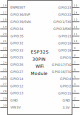

# Components for fritzing that I designed or modified to fit my ideas

## [Click here to see my instructions for making Fritzing components](./../How_I_make_my_own_PCB/README.md)

## Link to Others Fritzing libraries:

* Others libraries
  * [JORGE ELIECER CHACON FLOREZ](https://github.com/jorgechacblogspot/librerias_fritzing)
  * [XZ manj](https://github.com/Atsumitsu/fritzing-parts)

## My Part list

* Power Mosfet
  * [FQP27P06 60V P-Channel MOSFET](./FQP27P06/FQP27P06.fzpz)
* Voltage regulator  
  * [HW-613 Step-Down Converter](./HW-613/HW-613.fzpz)
  * [LDO (AMS1117-T33 0.8A Fixed Low Dropout Linear Regulator)](./LDO/LDO_+3V3.fzpz)
  * [MP1584 Step-Down Converter](./MP1584/)
* CPU
  * [Olimex-ESP32-POE 20pins](./Olimex-ESP32-POE/Olimex-ESP32-PoE_20pins/ESP32-PoE_20.fzpz)
  * [Olimex-ESP32-POE 32pins](./Olimex-ESP32-POE/Olimex-ESP32-PoE_32pins/Olimex-ESP32-PoE%2032pins.fzpz)
* I/O interface  
  * [PFC8574N 8-Bit I/O Expander for I2C Bus](./PFC8574N/)
  * [ULN2803A Eight Darlington arrays](./ULN2803A/)
  * [DS18B20 1-Wire Digital Thermometer](./DS18B20/DS18B20%201-Wire%20Temperature%20Sensor.fzpz)
* Resistor
  * [Sil Resistor 4x470Ω](./Resistor/Resistor%20SIP%204x470Ω%20-%205%20pins.fzpz)
  * [9Pin sil Resistor 8x470Ω]()
* [Stripboard](./README.md#stripboard)
  * [Stripboard_49x18](./README.md#stripboard_49x18)
  * [RadeMacher-typ922 & 941](./README.md#rademacher-typ922)

## [FQP27P06 60V P-Channel MOSFET](./FQP27P06/)

I use this P-Mosfet for Reverse Polarity Protection Circuits, and I want a part that lay flat on the PCB.

|Breadboard|PCB|Schematic|
|:---:|:---:|:---:|
||||

* find fzpz files here: [FQP27P06](./FQP27P06/FQP27P06.fzpz)
* Datasheet: [FQP27P06 60V P-Channel MOSFET](https://www.sparkfun.com/datasheets/Components/General/FQP27P06.pdf)

## [HW-613 Step-Down Converter](./HW-613/)

A cheap dc-dc converter from aliexpress,  
Mini DC-DC 12-24V To 5V 3A Step Down Power Supply Module Voltage Buck Converter Adjustable 97.5% 1.8V 2.5V 3.3V 5V 9V 12V 24V

|Breadboard|PCB|Schematic|
|:---:|:---:|:---:|
||||

* find fzpz files here: [HW-613](./HW-613/HW-613.fzpz)

## [LDO (AMS1117-T33) 0.8A Fixed Low Dropout Linear Regulator](./LDO/)

|Breadboard|PCB|Schematic|
|:---:|:---:|:---:|
|||

* find fzpz files here: [LDO (AMS1117-T33)](./LDO/LDO_+3V3.fzpz)
* Datasheet: [AMS1117 LDO](https://pdf.direnc.net/upload/ams1117-datasheet.pdf)

## [MP1584 Step-Down Converter](./MP1584/)

|Breadboard|PCB|Schematic|
|:---:|:---:|:---:|
|||

* find fzpz files here: [MP1584](./MP1584/MP1584.fzpz)
* [Datasheet: 3A, 1.5MHz, 28V Step-Down Converter](https://www.monolithicpower.com/en/mp1584.html)

## [ESP30 DevKit v1 (30 pins long, 11 pins width)](./ESP32/)

Maked by Werner Rothschopf (modified by vanepp Dec 2018), I removed 3v3 text from pcb.

|Breadboard|PCB|Schematic|
|:---:|:---:|:---:|
|||

* find fzpz files here: [ESP32 DevKit v1](./ESP32/DOIT%20Esp32%20DevKit%20v1%20(30%20pins%20long,%2011%20pins%20width).fzpz)
* Datasheet: [ESP32 DevKit v1](https://mischianti.org/doit-esp32-dev-kit-v1-high-resolution-pinout-and-specs/)

## [Olimex-ESP32-POE](./Olimex-ESP32-POE/)

* find fzpz files here: [Olimex-ESP32-PoE](./Olimex-ESP32-POE/Olimex-ESP32-PoE_20pins/ESP32-PoE_20.fzpz)
* Datasheet: [Olimex-ESP32-POE](https://www.olimex.com/Products/IoT/ESP32/ESP32-POE/open-source-hardware "www.olimex.com")

## [Olimex-ESP32-POE 20pins](./Olimex-ESP32-POE/Olimex-ESP32-PoE_20pins/ESP32-PoE_20.fzpz)
|Breadboard|PCB|Schematic|
|:---:|:---:|:---:|
|||

## [Olimex-ESP32-POE 32pins](./Olimex-ESP32-POE/Olimex-ESP32-PoE_32pins/Olimex-ESP32-PoE%2032pins.fzpz)
|Breadboard|PCB|Schematic|
|:---:|:---:|:---:|
||||

## [PFC8574N 8-Bit I/O Expander for I2C Bus](./PFC8574N/)

|Breadboard|PCB|Schematic|
|:---:|:---:|:---:|
||||

* find fzpz files here: [PFC8574N](./PFC8574N/PCF8574N.fzpz)
* Datasheet: [PFC8574N 8-Bit I/O Expander for I2C Bus](https://www.ti.com/lit/ds/symlink/pcf8574.pdf?ts=1698990306399)

## [ULN2803A Eight Darlington arrays](./ULN2803A/)

|Breadboard|PCB|Schematic|
|:---:|:---:|:---:|
||||

* find fzpz files here: [ULN2803A](./ULN2803A/ULN2803A.fzpz)
* Datasheet: [ULN280x Eight Darlington arrays](https://www.st.com/resource/en/datasheet/uln2801a.pdf)

## [DS18B20 1-Wire Digital Thermometer](./DS18B20/)

|Breadboard|PCB|Schematic|
|:---:|:---:|:---:|
||||

* find fzpz files here: [DS18B20 1-Wire Digital Thermometer)](./DS18B20/DS18B20%201-Wire%20Temperature%20Sensor.fzpz)
* Datasheet: [DS18B20 1-Wire Digital Thermometer](https://www.analog.com/media/en/technical-documentation/data-sheets/ds18b20.pdf)

## Resistor [Sil Resistor 4x470Ω](./Resistor/)

### [5 Pin sil Resistor 4x470Ω](./Resistor/)

|Breadboard|PCB|Schematic|
|:---:|:---:|:---:|
||||

* find fzpz files here: [Sil Resistor 4x470Ω](./Resistor/Resistor%20SIP%204x470Ω%20-%205%20pins.fzpz)

### [9 Pin sil Resistor 8x470Ω](./Resistor/)

|Breadboard|PCB|Schematic|
|:---:|:---:|:---:|
||||

* find fzpz files here: [) Pin sil Resistor 8x470Ω](./Resistor/8%20Resistor%20Network.fzpz)

## Stripboard

### Stripboard_49x18

|Breadboard|
|:---:|
|

* Fritzing files:
  * [Stripboard_49x18.fzz](./Stripboard/Stripboard_49x18.fzz)

### RadeMacher Typ922

|Breadboard|
|:---:|
|

* Fritzing files:
  * [RadeMacher_Typ922.fzz](./Stripboard/RadeMacher_Typ922.fzz)
* conradelektronik.dk
  * [Rademacher WR-Typ 922 Printplade til eksperimenter Hårdt papir (L x B) 160 mm x 100 mm 35 µm Rastermål 2.54 mm Indhold](https://www.conradelektronik.dk/da/p/rademacher-wr-typ-922-printplade-til-eksperimenter-haardt-papir-l-x-b-160-mm-x-100-mm-35-m-rastermaal-2-54-mm-indhold-521214.html?refresh=true)
  * [Rademacher WR-Typ 941 Europrintplade Epoxyd (L x B) 160 mm x 100 mm 35 µm Rastermål 2.54 mm Indhold 1 stk](https://www.conradelektronik.dk/da/p/rademacher-wr-typ-941-europrintplade-epoxyd-l-x-b-160-mm-x-100-mm-35-m-rastermaal-2-54-mm-indhold-1-stk-529568.html)

