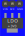
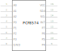

# Components for fritzing that I designed or modified to fit my ideas

I use inkscape to make the svg files, if you want to start making or editing components yourself, just download the svg files in my library and start customizing them, it took me a while to find a good way to make and texts give still torments me.  
If you want to draw your own components I can recommend these videos

* SidneyCritic ComedyHound Videos
  * [Fritzing](https://www.youtube.com/playlist?list=PLMkg9_AB9FZ9PggkzTS1MoHHN40Q2LW1Y "SidneyCritic ComedyHound")
  * [Fritzing Parts Fast](https://www.youtube.com/playlist?list=PLMkg9_AB9FZ-iJm_JIie2F8_M1DReYU0C "SidneyCritic ComedyHound")

## Part list

* [FQP27P06](./FQP27P06/FQP27P06.fzpz)
* [HW-613 Step-Down Converter](./HW-613/HW-613.fzpz)
* [LDO (AMS1117-T33)](./LDO/LDO_+3V3.fzpz)
* [MP1584 Step-Down Converter](./MP1584/)
* [Olimex-ESP32-POE](./Olimex-ESP32-POE/Olimex-ESP32-PoE_20pins/)
* [PFC8574N](./PFC8574N/)
* [ULN2803A](./ULN2803A/)

## FQP27P06

I use this P-Mosfet for Reverse Polarity Protection Circuits, and I want a part that lay flat on the PCB.

* find fzpz files here: [FQP27P06](./FQP27P06/FQP27P06.fzpz)

## HW-613 Step-Down Converter

A cheap dc-dc converter from aliexpress,  
Mini DC-DC 12-24V To 5V 3A Step Down Power Supply Module Voltage Buck Converter Adjustable 97.5% 1.8V 2.5V 3.3V 5V 9V 12V 24V

|Braedboard|PCB|Schematic|
|:---:|:---:|:---:|
||||

* find fzpz files here: [HW-613](./HW-613/HW-613.fzpz)

## LDO (AMS1117-T33)

|Braedboard|PCB|Schematic|
|:---:|:---:|:---:|
|||

* find fzpz files here: [LDO (AMS1117-T33)](./LDO/LDO_+3V3.fzpz)

## MP1584 

[Datasheet: 3A, 1.5MHz, 28V Step-Down Converter](https://www.monolithicpower.com/en/mp1584.html)

|Braedboard|PCB|Schematic|
|:---:|:---:|:---:|
|||

## Olimex-ESP32-POE

|Braedboard|PCB|Schematic|
|:---:|:---:|:---:|
|||

* find fzpz files here: [Olimex-ESP32-POE)](./Olimex-ESP32-POE/Olimex-ESP32-PoE_20pins/ESP32-PoE_20.fzpz)

## PFC8574N

|Braedboard|PCB|Schematic|
|:---:|:---:|:---:|
||||

* find fzpz files here: [PFC8574N)](./PFC8574N/PCF8574N.fzpz)

## ULN2803A

|Braedboard|PCB|Schematic|
|:---:|:---:|:---:|
||||

* find fzpz files here: [ULN2803A)](./ULN2803A/ULN2803A.fzpz)